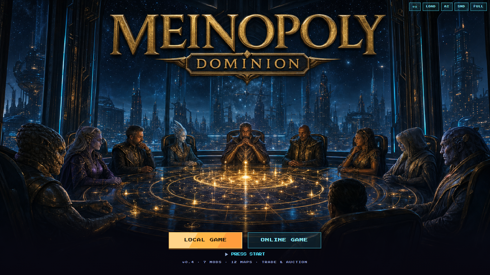
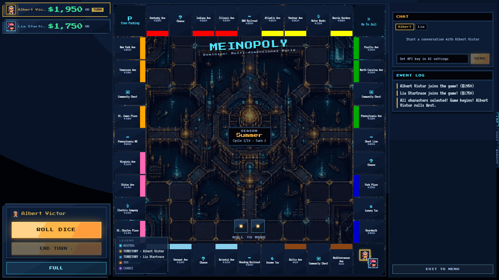
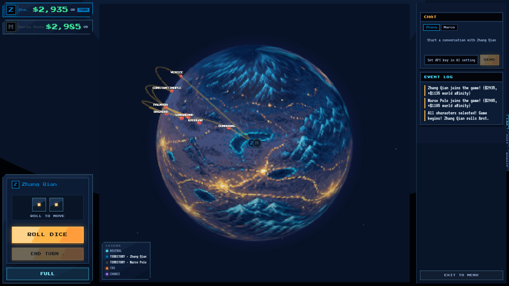

<div align="center">



# MEINOPOLY

**Every world can be a board game. Even the one inside a book.**

一个可改装、AI 驱动的大富翁式策略引擎 — 任何一本书，都能变成一个可玩的世界。

[English](#english) · [中文](#中文)

</div>

---

## English

Meinopoly is a moddable Monopoly-style strategy engine. The engine is constant — worlds, characters, boards, art, and rules are all **mods**, and mods can be **generated from a book by AI**.

### 📖 Turn any book into a game — one command

```bash
npm run create-mod -- mybook.txt --from-book --portraits --boardbg --auto-balance
```

Feed it a novel. Out comes a complete, playable mod:

- **Characters** extracted from the text — 6 gameplay stats, passive abilities, and per-character lore
- **A map with real geography** — real places get real coordinates; fictional worlds get AI layouts
- **Pixel-art portraits** for the whole cast and **era-styled board art**, generated to match the book's world
- **Per-place descriptions** pulled from the source, shown in-game
- **Auto-balancing** — a built-in tournament simulator tunes the roster until no character is statistically over- or under-powered

Costs are printed before any API spend; every step is idempotent and re-runnable.

### 🌍 Three ways to see a world

| Classic ring | War-room atlas | Pixel globe |
|---|---|---|
| The familiar loop, reskinned per world | Node-card cities over painted terrain, glowing route networks | A rotating night-lights planet you play on |





### ⚔️ More than roll-and-buy

- **Rent duels** — challenge the landlord to a stat showdown instead of paying (win: rent waived; lose: pay double)
- **Trading & auctions** — full negotiation between players, round-robin bidding on passed properties
- **Characters that matter** — Capital, Luck, Negotiation, Charisma, Tech, Stamina all hook into real money flows; luck earns card redraws
- **Living boards** — seasons shift prices, event cards can force buys, upgrades, or teleports; 4 building tiers from House to Landmark
- **Three victory modes** — Last Standing, Timed-Richest, or Dominion (control the map)

### 🤖 AI at the table

- **Local bots** with distinct play styles fill empty seats
- **AI characters** react to the game and chat in-character, built from their lore (optional, OpenAI key)
- **MCP server** — LLM agents can join a running match as *real seated players*: `npm run mcp` exposes state, legal moves, and move execution over the Model Context Protocol. Yes, Claude can sit at your table.

### 🀄 Fully bilingual

One click flips the entire game between **中文** and **English** — UI, boards, and the full event log re-render live.

### 🔧 Built like software, not a demo

- [boardgame.io](https://boardgame.io) core, seat-authorized online multiplayer, save/load
- **1,479 unit tests + 45 end-to-end tests**, golden-scenario message pinning, headless balance tournaments with CI-gated fairness flags
- Six worlds ship in the box: **Dominion** (sci-fi council), **Terra Titans** (16 historical leaders on a globe), **Ancient Empires**, **Steam Barons**, **Silk Road**, **Gilded Rails**

### Quick start

```bash
npm install
npm start            # play at http://localhost:1234
npm run server       # online multiplayer server (port 8088)
npm run sim          # headless balance tournament
npx jest --no-coverage   # run the test suite
```

---

## 中文

Meinopoly 是一个**可改装**的大富翁式策略引擎：引擎不变，世界、角色、棋盘、美术、规则全部是 **mod**——而 mod 可以由 AI **从一本书直接生成**。

### 📖 一行命令，把一本书变成一局游戏

```bash
npm run create-mod -- 三国演义.txt --from-book --portraits --boardbg --auto-balance
```

喂它一本小说，吐出一个完整可玩的 mod：

- **角色**从原文提取——6 项对局属性、被动技能、逐角色背景故事
- **带真实地理的地图**——真实地名用真实经纬度，架空世界由 AI 排布
- 整套**像素头像**与匹配时代风格的**棋盘美术**自动生成
- **每格简介**取自原著，游戏内点击即看
- **自动平衡**——内置锦标赛模拟器反复调参，直到没有角色在统计上过强或过弱

任何 API 花费前都会先打印成本计划；每一步幂等、可重跑。

### 🌍 一个世界，三种打开方式

| 经典环形棋盘 | 战情室地图 | 像素地球 |
|---|---|---|
| 熟悉的循环，每个世界换装 | 手绘地形上的城市节点卡，路线网络发光 | 在一颗会转的夜光星球上落子 |

### ⚔️ 不止掷骰买地

- **租金对战**——落进别人地盘可以不交租，改为属性对决单挑地主（赢了免租，输了双倍）
- **交易与拍卖**——玩家间自由谈判；弃购的地产进入轮流竞价
- **角色真的有用**——资本、幸运、谈判、魅力、科技、体力全部挂进真实的金钱流；幸运还能重抽事件卡
- **活的棋盘**——四季轮转影响物价，事件卡会强制购地、免费升级、瞬移；房产四级进阶直到地标
- **三种胜利方式**——最后生还 / 限时首富 / 版图支配

### 🤖 AI 上桌

- **本地机器人**性格各异，随时补位
- **AI 角色**按各自的人设背景对局面做出反应、和你聊天（可选，需 OpenAI key）
- **MCP 服务器**——LLM 智能体能以**真实玩家席位**加入对局：`npm run mcp` 通过 Model Context Protocol 暴露状态、合法着法与行棋接口。没错，Claude 可以坐在你的牌桌上。

### 🀄 完整双语

一键在**中文 / English** 间切换——界面、棋盘、整条事件日志实时重渲染。

### 🔧 按软件工程标准打造

- [boardgame.io](https://boardgame.io) 内核、席位鉴权的在线多人、存档/读档
- **1,479 个单元测试 + 45 个端到端测试**、金样场景文本锁定、CI 门控公平性标记的无头平衡锦标赛
- 开箱自带六个世界：**Dominion**（科幻议会）、**泰坦纪元**（16 位历史领袖的地球）、**上古帝国**、**蒸汽大亨**、**丝绸之路**、**镀金铁路**

### 快速开始

```bash
npm install
npm start            # 本地游玩 http://localhost:1234
npm run server       # 在线多人服务器（8088 端口）
npm run sim          # 无头平衡锦标赛
npx jest --no-coverage   # 跑测试
```
